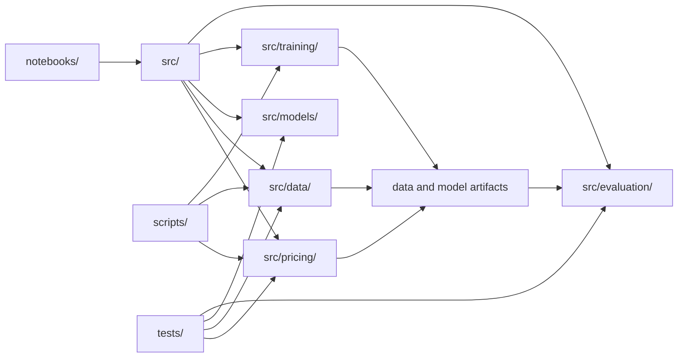
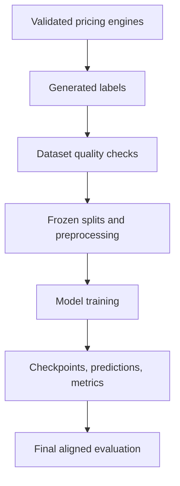

# System Architecture

## Purpose

This document explains the project as one technical system. The objective is not merely to train neural networks. The system must establish a defensible chain from a validated numerical pricing rule to reproducible neural surrogates and a final decision about where those surrogates add value.

## Core pricing problem

The project learns the static mapping

$$
x =
\left[
\log(S/K),
T,
r,
q,
\sigma
\right]
\longmapsto V_A,
$$

where $S$ is spot, $K$ is strike, $T$ is time to maturity, $r$ is the continuously compounded risk-free rate, $q$ is continuous dividend yield, $\sigma$ is annualized volatility, and $V_A$ is the American put value produced by the selected numerical reference.

The neural networks are **surrogate numerical pricers**. They do not forecast the underlying asset and do not learn from future market prices.

## Architectural layers



### `notebooks/`

The notebooks are the executable research paper:

- Notebook 01 defines the financial problem, literature, research questions, and hypotheses.
- Notebooks 02–03 validate the numerical foundation and data design.
- Notebooks 04–08 implement the model experiments.
- Notebook 09 aligns the saved evidence and produces the final conclusion.

Model classes, pricing engines, reusable losses, training loops, and metric functions are not implemented inside notebook-only code.

### `src/pricing/`

This layer contains the reference financial calculations:

- scalar Black–Scholes–Merton call and put pricing;
- scalar Cox–Ross–Rubinstein pricing with root-node diagnostics;
- risk-neutral path simulation;
- classical Longstaff–Schwartz valuation;
- validation helpers and optional QuantLib comparisons.

The scalar implementations emphasize explicit validation and readability. Production generation uses a separate Numba-accelerated batch implementation with the same financial definitions.

### `src/data/`

This layer defines:

- production parameter ranges;
- Latin hypercube sampling;
- Numba batch pricing;
- component generation and manifests;
- dataset validation;
- deterministic split logic;
- derived targets for residual and multi-head models;
- PyTorch dataset and DataLoader interfaces.

### `src/models/`

This layer contains six model families:

1. direct normalized-price MLP;
2. residual premium/floor MLP;
3. exercise-only classifier;
4. shared-backbone price-and-exercise model;
5. time-indexed neural Longstaff–Schwartz continuation networks;
6. integrated four-head static model.

### `src/training/`

This layer contains:

- deterministic seeding;
- reusable PyTorch training and inference loops;
- weighted residual losses;
- multi-task and multi-head objectives;
- early stopping and learning-rate scheduling;
- atomic checkpoint writing;
- artifact-completion manifests;
- dependency fingerprints.

### `src/evaluation/`

This layer contains:

- pricing and classification metrics;
- segmented errors;
- financial consistency checks;
- boundary metrics;
- OOD analysis;
- runtime benchmarks;
- artifact registry and package adapters;
- cross-notebook lineage and prediction alignment;
- formal H1–H6 decision rules;
- final reporting and export validation.

### `scripts/`

Scripts execute expensive or project-wide tasks outside interactive notebooks. The main production generation entry point is:

```bash
python scripts/generate_production_dataset.py
```

Additional scripts support final-model training, project validation, and final-results construction.

### `tests/`

The test suite verifies the numerical foundation and reusable contracts. It is supporting evidence: the tests are not the research result, but they prevent an incorrect pricing or data pipeline from silently generating plausible-looking neural results.

## Dependency direction

The project enforces the following dependency order:



A downstream layer must not repair an upstream methodological defect:

- a neural model cannot validate its own labels;
- a test-set result cannot select a checkpoint;
- an OOD set cannot fit a scaler;
- Notebook 09 cannot retrain or reinterpret stale artifacts;
- a financial violation cannot be hidden by reporting only average MAE.

## Static and path-based branches

The project has two different computational branches.

### Static surrogate branch

The static models consume one five-variable contract state and return a price, an exercise probability, or multiple related outputs. Once trained, they support fast batched inference.

### Path-based branch

Classical and neural Longstaff–Schwartz consume simulated paths and time-indexed states. They estimate continuation policies through backward recursion. Their outputs are not placed in the same static leaderboard because the input representation, sampling uncertainty, runtime, and contract sample differ.

## Financial structure as an architectural input

The strongest static model uses the financial floor

$$
F = \max(V_E, I),
$$

where $V_E$ is the European Black–Scholes value and $I=\max(K-S,0)$ is intrinsic value.

The network predicts a non-negative residual $R_F$:

$$
\widehat{V}_A = F + \operatorname{Softplus}(\widehat{R}_F).
$$

This guarantees:

$$
\widehat{V}_A \geq 0,
$$

$$
\widehat{V}_A \geq I,
$$

and

$$
\widehat{V}_A \geq V_E.
$$

The system therefore uses financial knowledge to reduce the learning burden and prevent specific invalid outputs.

## Artifact-driven final evaluation

Notebook 09 does not accept arbitrary filenames or whichever checkpoint happens to be present. The artifact system records and validates:

- notebook identity;
- training profile;
- canonical checkpoint;
- model configuration;
- feature ordering;
- feature-scaler hash;
- production-manifest hash;
- prediction-table schema;
- row counts;
- selected thresholds;
- completion status.

The final lineage audit then confirms that static predictions share the same `sample_id` set and the same true target before model errors are compared.

## Design principles

1. **Simple architecture before unnecessary complexity.**
2. **Financially structured targets before larger networks.**
3. **Training-only preprocessing.**
4. **Validation-only model selection.**
5. **Test and OOD evidence reserved for final evaluation.**
6. **Architectural guarantees separated from empirical checks.**
7. **Static and path-based methods compared only on compatible questions.**
8. **Numerical methods retained as reference and fallback.**
9. **Generated artifacts excluded from source control but fully specified by manifests.**
10. **Negative results retained when additional neural complexity does not add value.**

## Related notebooks

- Notebook 01: research architecture and scope
- Notebook 02: numerical validation
- Notebook 03: data design and splits
- Notebooks 04–08: model branches
- Notebook 09: artifact-driven synthesis
