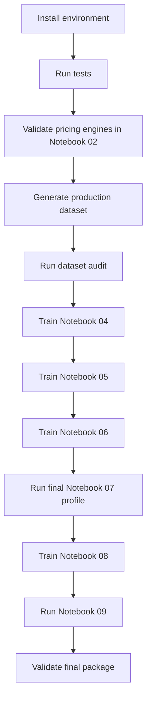

# Reproducibility and Execution

## Purpose

This document provides the operational sequence for reproducing the project and distinguishes development execution from academically valid full runs.

## Environment

Target:

- Python 3.10 or later;
- Windows, Linux, or managed notebook environment;
- CPU supported;
- CUDA optional for training and inference;
- sufficient disk space for generated Parquet data and artifacts.

Install:

```bash
python -m pip install --upgrade pip
pip install -r requirements.txt
```

For CUDA, install the appropriate PyTorch build first, then install the remaining requirements.

## Main dependencies

Core:

- NumPy
- pandas
- SciPy
- PyArrow
- scikit-learn
- PyTorch
- Numba

Finance:

- QuantLib

Notebook/reporting:

- JupyterLab
- nbformat
- nbconvert
- Matplotlib

Testing:

- pytest
- pytest-cov

QuantLib is required for the independent validation and standard-engine benchmarks. The project pricing and neural workflows do not silently substitute QuantLib for missing project artifacts.

## Repository execution order



## 1. Run tests

```bash
python -m pytest -q
```

Coverage:

```bash
python -m pytest --cov=src --cov-report=term-missing
```

The pricing tests should pass before production label generation.

## 2. Generate production data

```bash
python scripts/generate_production_dataset.py
```

Expected outputs:

```text
data/generated/
├── american_put_core.parquet
├── american_put_boundary.parquet
├── american_put_ood_high_volatility.parquet
├── american_put_ood_extreme_moneyness.parquet
├── american_put_ood_long_maturity.parquet
└── american_put_ood_rate_dividend.parquet
```

Manifest:

```text
data/manifests/production_dataset_manifest.json
```

The script is restartable, and skips completed components unless `--overwrite` is used.

## 3. Execute notebooks

The notebooks should be executed in numeric order.

```text
01_option_pricing_foundations.ipynb
02_american_option_data_generation.ipynb
03_dataset_analysis_and_validation.ipynb
04_direct_mlp_pricer.ipynb
05_early_exercise_premium_model.ipynb
06_exercise_boundary_analysis.ipynb
07_neural_longstaff_schwartz.ipynb
08_final_multihead_model.ipynb
09_final_evaluation.ipynb
```

Notebooks may be launched from the repository root or `notebooks/`; path setup resolves `PROJECT_ROOT`.

## 4. Training profiles

### Smoke or development execution

Purpose:

- verify imports;
- test complete code paths;
- reduce runtime;
- expose schema and shape errors.

Smoke results are not final academic evidence.

### Full static execution

Notebooks 04, 05, 06, and 08 must declare `training_profile="full"` in final packages.

### Final LSM execution

Notebook 07 must declare `training_profile="final"`.

The artifact registry rejects other profiles for the final synthesis.

## 5. Artifact sequence

Notebook 04 establishes:

- feature scaler;
- direct checkpoint;
- common test predictions.

Notebook 05 requires:

- production data;
- Notebook 04 scaler and direct checkpoint.

Notebook 06 requires:

- production data;
- shared scaler;
- selected Notebook 05 package.

Notebook 07 uses its own path simulation and policy package.

Notebook 08 requires:

- production data;
- prior static model artifacts for comparison and optional warm start.

Notebook 09 requires all final artifacts but trains no model.

## 6. Project-wide validation scripts

The repository includes scripts for project validation and final result construction. Run them from the repository root according to their command-line help:

```bash
python scripts/validate_production_project.py --help
```

```bash
python scripts/build_final_results.py --help
```

```bash
python scripts/train_final_multihead.py --help
```

The notebooks remain the academic source of truth; scripts support expensive or repeatable execution.

## 7. Generated files and Git

Generated data and model artifacts should remain outside Git because of size and reproducibility.

Tracked files should include:

- source code;
- notebooks;
- documentation;
- tests;
- configuration;
- small manifests that are intentionally part of the reproducibility record.

Ignored outputs should include:

- generated Parquet datasets;
- model checkpoints;
- runtime exports;
- notebook caches;
- `.pytest_cache`;
- coverage files;
- `.virtual_documents`.

## 8. CPU and GPU handling

Training selects CUDA when available.

Mixed precision is used only on CUDA.

Checkpoints should be loaded with an explicit `map_location` when moving between devices.

Runtime comparisons must report the device. CPU and GPU timings must not be merged without clear labels.

## 9. Determinism

Fixed seeds control:

- parameter sampling;
- split allocation;
- DataLoader shuffling;
- model initialization;
- path simulation;
- benchmark inputs.

Reproduction still depends on:

- library versions;
- hardware;
- floating-point implementation;
- thread scheduling;
- optional QuantLib version.

Manifests and environment reporting make these dependencies visible.

## 10. Troubleshooting

### Missing production files

Error: required Parquet components are absent.

Action:

```bash
python scripts/generate_production_dataset.py
```

### Stale checkpoint

Symptom: artifact inspection reports dependency mismatch.

Cause:

- production manifest changed;
- scaler changed;
- feature order changed.

Action: retrain the affected model rather than forcing package reuse.

### Wrong profile

Symptom: Notebook 09 rejects a complete-looking package.

Cause: smoke or development artifact.

Action: run the full/final profile and regenerate final metrics.

### CUDA checkpoint on CPU

Use checkpoint loaders with `map_location="cpu"`.

### QuantLib import error

Install the declared QuantLib dependency. If an optional cell skips, do not describe the independent validation as completed.

### DataLoader produces no observations

Check:

- split filter;
- row limit;
- `drop_last`;
- input file contents.

### Invalid CRR probability

Increase tree steps or review extreme parameters. Do not clip a materially invalid probability in the scalar reference engine.

### Notebook sees wrong project root

Run from repository root or `notebooks/`. Confirm the printed `PROJECT_ROOT`.

### Notebook 09 alignment failure

Do not patch the final table. Recreate the stale upstream prediction artifact on the frozen test split.

### Missing final charts

Ensure business-case charts are copied into:

```text
artifacts/final_evaluation/final/charts/
```

before rebuilding the final export manifest.

## 11. Final readiness

A complete submission should satisfy:

- tests pass;
- production manifest reports 1,450,000 observations;
- all static final packages use the full profile;
- Notebook 07 uses the final profile;
- static prediction alignment passes;
- all H1–H6 decisions are present;
- final charts and tables are exported;
- final readiness audit passes;
- README and docs report only final evidence.

## Related notebooks

All notebooks, with Notebook 09 as the final execution gate.
