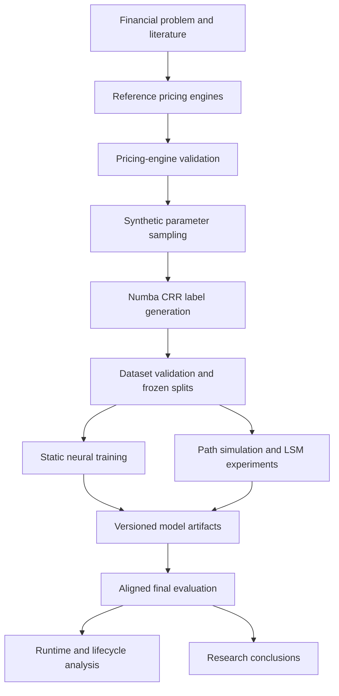

# Technical Documentation

This directory documents the engineering implementation of the American put pricing project.

The notebooks remain the executable research narrative. They explain the financial motivation, literature, experiments, outputs, and conclusions. The `src/` package contains reusable implementation, the `tests/` directory verifies the numerical and software contracts, and this documentation explains how those parts work together.

## Documentation map

| Document | Technical scope | Primary notebooks | Primary implementation |
|---|---|---|---|
| [System architecture](01_system_architecture.md) | End-to-end workflow, repository layers, dependency direction | 01–09 | `src/`, `scripts/`, `tests/` |
| [Pricing engines](02_pricing_engines.md) | Black–Scholes, CRR, QuantLib validation, Longstaff–Schwartz | 01, 02, 07 | `src/pricing/` |
| [Synthetic data pipeline](03_synthetic_data_pipeline.md) | Parameter sampling, Numba pricing, components, chunking, manifests | 02, 03 | `src/data/production_generation.py` |
| [Dataset schema and splits](04_dataset_schema_and_splits.md) | Column contract, normalization, deterministic splits, leakage controls | 03–08 | `src/data/`, `src/data/torch_datasets.py` |
| [Model architectures](05_model_architectures.md) | Direct, residual, classifier, multi-task, neural LSM, integrated models | 04–08 | `src/models/` |
| [Training and artifact management](06_training_and_artifact_management.md) | Training loops, losses, checkpoints, manifests, dependency fingerprints | 04–08 | `src/training/` |
| [Evaluation framework](07_evaluation_framework.md) | Metrics, financial checks, boundary analysis, OOD tests, cross-model alignment | 04–09 | `src/evaluation/` |
| [Runtime and business case](08_runtime_and_business_case.md) | Warm/cold timing, scaling, crossover, lifecycle break-even | 09 | business-case evaluation modules |
| [Reproducibility and execution](09_reproducibility_and_execution.md) | Environment, commands, profiles, artifact sequence, troubleshooting | 02–09 | `requirements.txt`, `scripts/`, manifests |
| [Results reference](10_results_reference.md) | Frozen final results and source artifacts | 09 | final result packages |

## End-to-end view

## Source-of-truth policy

The project uses four complementary sources of truth:

1. **Notebooks** are the executable academic presentation.
2. **Source modules** contain reusable pricing, data, model, training, and evaluation logic.
3. **Generated artifacts** contain the actual fitted models, predictions, metrics, and manifests used in the final comparison.
4. **Tests** verify numerical identities, financial constraints, schemas, and reproducibility contracts.

Documentation must not replace those sources. It explains their interfaces, dependencies, and failure modes.

## Mathematical formatting

Display equations use double-dollar delimiters:

$$
V_A = \max(I, C).
$$

Inline expressions use single-dollar delimiters, for example $V_A \geq V_E$.

## Recommended reading order

For a technical review, read:

1. `01_system_architecture.md`
2. `02_pricing_engines.md`
3. `03_synthetic_data_pipeline.md`
4. `04_dataset_schema_and_splits.md`
5. `05_model_architectures.md`
6. `06_training_and_artifact_management.md`
7. `07_evaluation_framework.md`
8. `08_runtime_and_business_case.md`
9. `09_reproducibility_and_execution.md`
10. `10_results_reference.md`

For an academic review, begin with Notebook 01 and conclude with Notebook 09.
